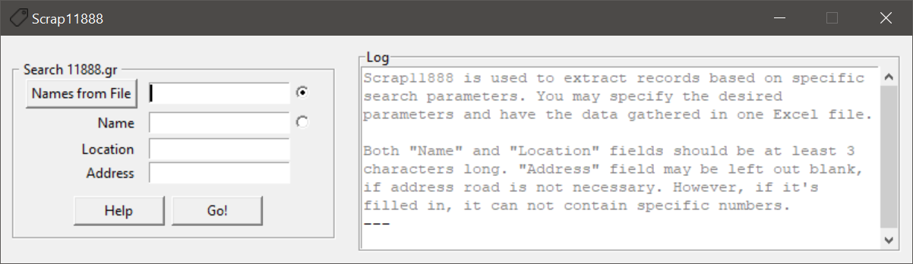

# Scrap11888
A simple data scraping utility, used to extract data from 11888.gr

## Important Dependencies
Manually-Resolved:
- [Python](https://www.python.org/)
- pip
- tkinter

> Note that  `pip` and `tkinter` can be easily installed via the default Python wizard-installer on Windows systems. Look for the appropriate checkboxes.

Auto-Resolved:
- requests
- openpyxl

## Features
- Query 11888 by name or by namelist (.xlsx format)
- Search people by geographical location
- Filter by address
- Embedded caching system
- Multithreading => Speed

## Quick Start
1. Make sure that you have downloaded/ configured the manually resolved dependencies (see above) on your system
2. Optionally, create a Python Virtual Environment and activate it. See how [here](https://docs.python.org/3/library/venv.html)
2. On a terminal run `pip install Scrap11888`
3. Run `scrap`

> Just in case the script is not recognized (more likely in Linux systems), just import the package manually and run it. `python -c "import Scrap11888; Scrap11888.main()"` should do the trick.

## Notes
**GDPR:** All gathered data should be manually deleted within a month since scrap-day. Auto-deletion feature will soon be available.

**Scraping Ethics:** Scraping is an automated process of data fetching, based on legal communication between user's computer and server of interest (11888). In order to achieve high speeds, Scrap11888 makes a considerable amount of parallel, frequent queries. This impacts server's resources, lowering its ability to respond to other users quickly as well. Thus, users are strongly recommended to respect target server by limiting their scrap-searches to just _a few per hour_.
